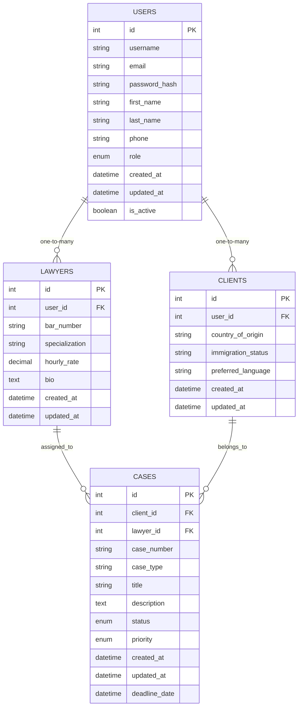
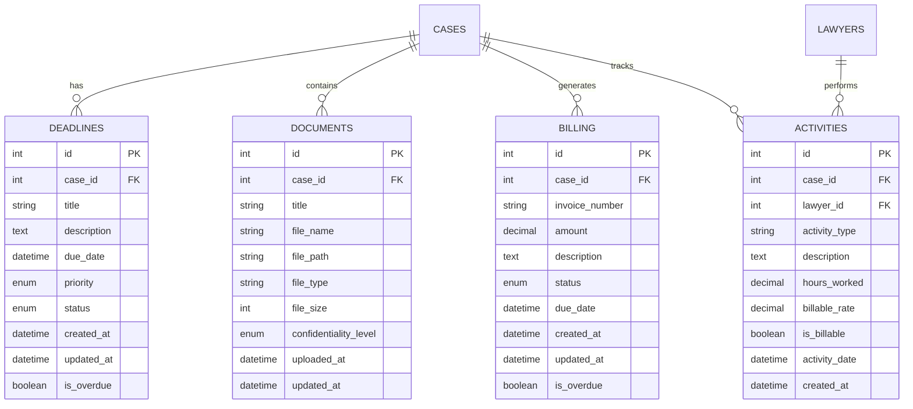

# 🏗️ Immigration Law Dashboard - Entity Relationship Diagram (ERD)

## Database Schema Overview

This document contains the Entity Relationship Diagram and database schema for the Immigration Law Dashboard system.

---

## 📊 Core Entities & Relationships

### **Phase 1 Entities**



### **Phase 2 Entities**



---

## 🔗 Relationship Details

### **User Management**
- **Users** → **Lawyers**: One-to-Many (A user can be a lawyer)
- **Users** → **Clients**: One-to-Many (A user can be a client)

### **Case Management** 
- **Lawyers** → **Cases**: One-to-Many (A lawyer can handle multiple cases)
- **Clients** → **Cases**: One-to-Many (A client can have multiple cases)

### **Phase 2 Relationships**
- **Cases** → **Deadlines**: One-to-Many (A case can have multiple deadlines)
- **Cases** → **Documents**: One-to-Many (A case can have multiple documents)
- **Cases** → **Billing**: One-to-Many (A case can have multiple billing records)
- **Cases** → **Activities**: One-to-Many (A case can have multiple activities)
- **Lawyers** → **Activities**: One-to-Many (A lawyer can perform multiple activities)

---

## 📋 Field Specifications

### **Enums & Status Values**

#### User Roles
- `admin` - System administrator
- `lawyer` - Legal practitioner
- `client` - Client user

#### Case Status
- `open` - Active case
- `in_progress` - Case being worked on
- `closed` - Completed case
- `on_hold` - Temporarily paused

#### Case Priority
- `low` - Low priority
- `medium` - Medium priority
- `high` - High priority
- `urgent` - Urgent priority

#### Deadline Status
- `pending` - Not yet due
- `completed` - Finished
- `overdue` - Past due date

#### Billing Status
- `pending` - Invoice created
- `sent` - Invoice sent to client
- `paid` - Payment received
- `overdue` - Past due date
- `cancelled` - Invoice cancelled

#### Document Confidentiality
- `public` - No restrictions
- `confidential` - Restricted access
- `highly_confidential` - Highly restricted

---

## 🔧 Technical Implementation

### **Database Engine**
- **Primary**: SQL Server Express
- **ORM**: SQLAlchemy
- **Migration**: Alembic

### **Key Features**
- **Foreign Key Constraints**: Enforced referential integrity
- **Computed Properties**: Automatic status calculations
- **Timestamps**: Created/updated tracking
- **Soft Deletes**: Data preservation
- **Indexing**: Optimized query performance

---

## 📊 Data Flow

```
1. User Registration → User Table
2. Role Assignment → Lawyer/Client Table
3. Case Creation → Case Table
4. Case Activities → Deadlines, Documents, Billing, Activities Tables
5. Status Updates → Automatic computed properties
```

---

## 🔄 Database Migrations

All schema changes are version-controlled through:
- SQLAlchemy model definitions
- Automatic table creation on startup
- Foreign key relationship enforcement

---

**Last Updated**: September 2025  
**Version**: 2.0 (Phase 1 + Phase 2 Complete)  
**Total Tables**: 9 entities
