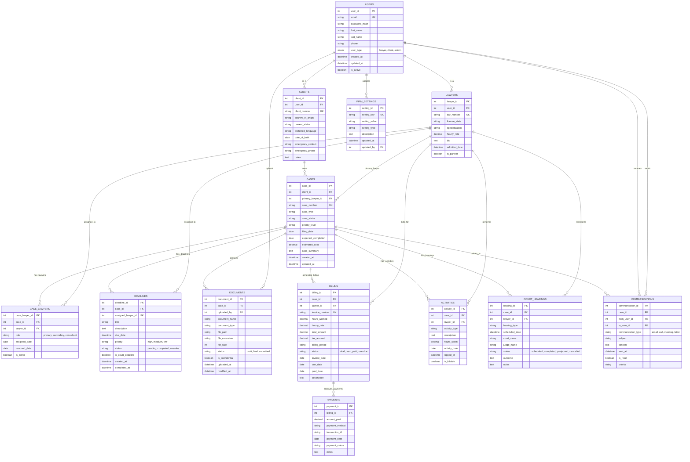

# Immigration Law Dashboard - Database ERD

## Entity Relationship Diagram

## Table Descriptions

### Core User Management
- **USERS**: Base authentication and user profile information
- **LAWYERS**: Legal professionals with credentials and specializations
- **CLIENTS**: Immigration clients with country of origin and status tracking

### Case Management
- **CASES**: Central case tracking with status, priority, and financial estimates
- **CASE_LAWYERS**: Junction table for multiple lawyers assigned to cases
- **DEADLINES**: Court deadlines and internal milestones with priority tracking

### Document Management
- **DOCUMENTS**: File storage with metadata, confidentiality, and version control
- **COMMUNICATIONS**: Multi-channel communication tracking between users

### Financial Management
- **BILLING**: Time-based billing with invoice generation and status tracking
- **PAYMENTS**: Payment processing and transaction management
- **ACTIVITIES**: Billable hour tracking and detailed case activity logging

### Legal Process Management
- **COURT_HEARINGS**: Court appearance scheduling and outcome tracking

### System Configuration
- **FIRM_SETTINGS**: Configurable system settings and firm branding options

## Key Relationships

1. **User Inheritance**: LAWYERS and CLIENTS inherit from USERS (1:1)
2. **Case Ownership**: Each CASE belongs to one CLIENT but can have multiple LAWYERS
3. **Document Security**: DOCUMENTS are linked to CASES with confidentiality controls
4. **Financial Tracking**: BILLING links to CASES and LAWYERS, with PAYMENTS tracking settlements
5. **Activity Logging**: All ACTIVITIES are tracked per CASE and LAWYER for billing accuracy
6. **Communication History**: All COMMUNICATIONS are preserved with case context

## Data Integrity Features

- Primary Keys (PK) ensure unique record identification
- Foreign Keys (FK) maintain referential integrity
- Unique Keys (UK) prevent duplicate critical data
- Enum constraints on status fields ensure data consistency
- Timestamp tracking for audit trails
